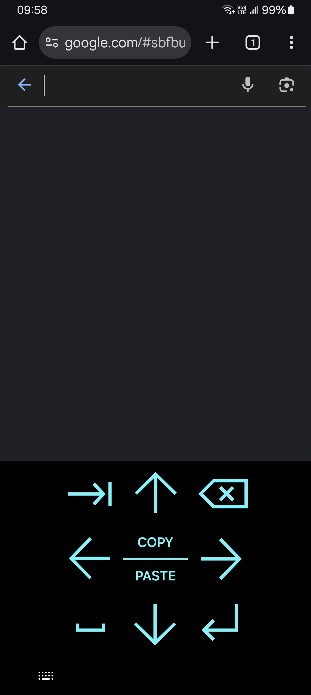
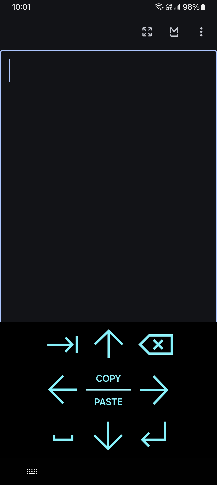

# Editor's Keyboard

This is a keyboard for editing text on Android. It consists of arrow keys, space, backspace, tab, enter, and the buttons for copying and pasting, but no alphabet keys nor number keys. Long pressing the keys will send key events (See the table below); long pressing the space key or the background (where no key is) will open the dialog for switching to another keyboard, as this keyboard only can help you editing but not writing.

It is designed for editing any text precisely, such as by inserting a word, a sentence, or a paragraph into a specific position. The large arrow keys are designed to help you to easily navigate within the text. (This is generally more useful in coding and prompt-engineering than in normal conversations, and more useful in writing in languages using more complex scripts than Latin script.)

It is designed to deal with most situations, even some of the edge cases. Nonstandard text field? Context menu not shown? Just long press the `COPY` button and this keyboard will simulate a `Ctrl+C` (by sending the key event). If you don't long press it, but instead click it normally, this keyboard will try to copy the selected text to the clipboard without sending any key event, in case that some applications, for example, maybe a terminal app, interpret `Ctrl+C` differently. However, both methods might not work, in which case this can't help you, and you would need to use another keyboard.

### Screenshots

### Details

| Key | When clicked | When long pressed |
| --- | ------------ | ----------------- |
| Up arrow | Move the cursor up | Send the key event of the keycode of "Page Up" |
| Down arrow | Move the cursor down | Send the key event of the keycode of "Page Down" |
| Left arrow | Move the cursor left | Send the key event of the keycode of "Home" (move to the start of the line) |
| Right arrow | Move the cursor right | Send the key event of the keycode of "End" (move to the end of the line) |
| Tab | Send the character of horizontal tab ('\t') | Send the key event of the keycode of the tab key of a keyboard |
| Space | Send the character of space (' ') | Show the dialog for switching to another keyboard |
| Backspace | Send the key event of a backspace key | Simulate Ctrl-Z (usually meaning "undo") |
| Enter | Send the key event of the enter key | Same as a short click |
| COPY | Copy the selected text (not using Ctrl-C) | Simulate Ctrl-C |
| PASTE | Paste the text from clipboard (not using Ctrl-V) | Simulate Ctrl-V |

In addition, this app also provides a keycode-first mode, meaning that it will send a key event by default, but send the normal text on a long click, as if working in a reversed way; and a plain-text mode, meaning that all copied/pasted text will be in plain text; and a keycode-first plain-text mode, which combines these two behaviors; and "auxiliary" keyboards, meaning they cannot and will not be used as the default input method.

As of version 2.0, this app provides eight different **input methods** that can be enabled/disabled independently. You typically only need to enable one of them, as the keyboard layouts are all same, only behaviors differ.

### Note

* As of version 2.1, the keyboard will always simulate a Ctrl-Z (usually meaning "undo") when the backspace key is long pressed. It is **not** a bug.

* Due to compatibility-related reasons, this app might keep targeting Android 15 for ever, but you can still use it on Android 16 or later (as long as you can still install it) as I do.
